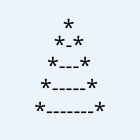
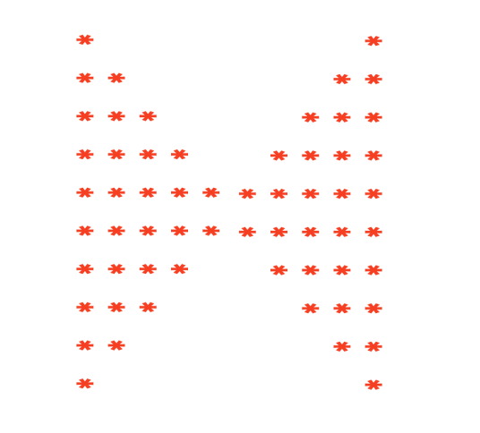
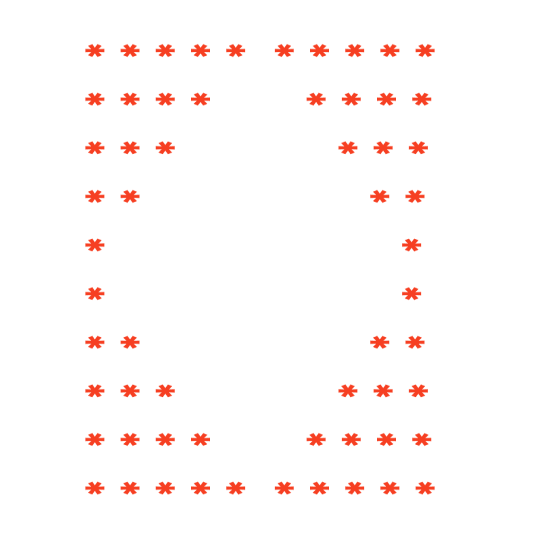
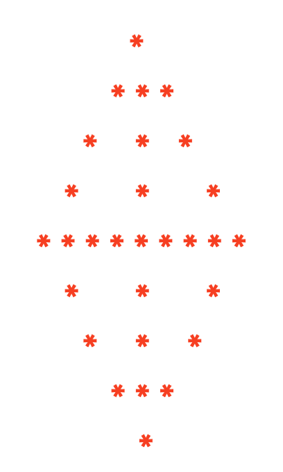

# random-pattern-questions-and-answers
## How to Contribute(unsolved questions)

1.  check the pattern you want to solve
2.  fork the repo
3.  create new branch and add your answers
4.  push to your forked repo
5.  finally create a Pullrequest

>
> 1.Write a program to print the following star pattern \* \*\
> \*\
> \*\
> \*\
> \* \* \* \*\
> \* \* \* \*\
> \*\
> \*\
> \*\
> \* \* \* \* \* \*\
> \* \* \* \* \* \*\
> \* \* \* \* \* \*
>
> 2.Write a program to print the following star pattern
>
> \*\
> \* \* \*\
> \*\
> \* \* \*\
> \* \* \*\
> \*
>
> \* \* \*\
> \* \* \*\
> \* \* \*\
> \*\
> \* \* \*\
> \* \* \*\
> \* \* \*\
> \* \* \*
>
> 3.Write a program to print the following star pattern \* \* \*\
> \* \* \*\
> \*\
> \* \* \* \* \* \*\
> \* \* \* \* \* \*\
> \*\
> \*\
> \* \* \* \* \* \* \* \* \*\
> \* \* \* \* \* \* \* \* \*
>
> 4.Write a program to print the following star pattern \* \* \* \*\
> \* \*\
> \* \* \* \* \* \* \* \*\
> \* \* \*\
> \* \* \* \* \* \* \* \* \* \* \* \*\
> \* \* \* \*\
> \* \* \* \* \* \* \* \* \* \* \* \* \* \* \* \*
>
> 6.Write a program to print the following star pattern \* \* \* \* \*\
> \*\
> \* \* \* \* \* \* \* \* \* \*\
> \*\
> \*\
> \* \* \* \* \* \* \* \* \* \* \* \* \* \* \*\
> \*\
> \*\
> \*\
> \* \* \* \* \* \* \* \* \* \* \* \* \* \* \* \* \* \* \* \*
>
> 7.Write a program to print the following star pattern \* \*
>
> \* \* \* \* \*\
> \* \*\
> \* \*\
> \* \* \* \* \* \* \* \* \* \*\
> \* \*\
> \* \*\
> \* \*\
> \* \* \* \* \* \* \* \* \* \* \* \* \* \* \*\
> \* \*\
> \* \*\
> \* \*\
> \* \*
>
> 8.Write a program to print the following star pattern \* \* \* \* \*\
> \*\
> \*\
> \* \* \*\
> \*\
> \*\
> \* \* \* \* \*\
> \*\
> \*\
> \* \* \*\
> \*\
> \*\
> \* \* \* \* \*
>
> 10.Write a program to print the following star pattern \* \*\
> \* \*\
> \* \* \* \* \*\
> \* \*\
> \* \*\
> \* \* \* \* \* \* \* \* \* \*\
> \* \*\
> \* \*\
> \* \* \* \* \* \* \* \* \* \* \* \* \* \* \*
>
> 11.Write a program to print the following star pattern \* \* \* \* \*\
> \*
>
> \*\
> \* \* \* \* \* \* \* \* \* \*\
> \*\
> \*\
> \*\
> \*\
> \* \* \* \* \* \* \* \* \* \* \* \* \* \* \*\
> \*\
> \*\
> \*\
> \*\
> \*\
> \*
>
> **12.**Print this pattern\
> \* \*\
> \* \*\
> \* \*\
> \* \*\
> \*\
> \* \*\
> \* \*\
> \* \*\
> \* \*\
> **13.***Print the array elements in the following pattern.*
>
> *\* \* \* \* \**\
> *\**\
> *\**\
> *\**\
> *\* \* \* \* \* \* \* \* \* \**\
> *\**\
> *\**\
> *\**\
> *\**\
> *\**\
> *\**
>
> *\* \* \* \* \* \* \* \* \* \* \* \* \* \* \**\
> **14.**Write a program to print the following star pattern.
>
> *\* \**\
> *\**\
> *\* \* \* \**\
> *\**\
> *\**\
> *\**\
> *\* \* \* \* \* \* \* \**\
> *\**\
> *\**\
> *\**\
> *\**\
> *\**
>
> **16.**Write a program to print the following star pattern.
>
> *\* \* \**\
> *\**\
> *\**\
> *\**\
> *\* \* \* \* \* \**\
> *\* \* \* \* \* \**\
> *\**\
> *\**\
> *\**\
> *\* \* \* \* \* \* \* \* \**\
> *\* \* \* \* \* \* \* \* \**\
> *\* \* \* \* \* \* \* \* \**\
> **17.**Write a program to print the following star pattern *\**\
> *\**\
> *\* \* \**\
> *\* \**\
> *\* \**\
> *\* \* \* \* \* \**\
> *\* \* \**\
> *\* \* \**\
> *\* \* \* \* \* \* \* \* \**
>
> **18.**Write a program to print the following number pattern.
>
> 1\
> 1 2\
> 1 2 3\
> 1 2 3 4\
> 1 2 3 4 5\
> 1 2 3 4 5 6
>
> **19.**Write a program to print the following Alphabets pattern.
>
> I\
> I N\
> I N D\
> I N D I\
> I N D I A
>
> **20.**Write a program to print the following Alphabets pattern.
>
> M\
> M A\
> M A L\
> M A L A\
> M A L A Y\
> M A L A Y A\
> M A L A Y A L\
> M A L A Y A L A\
> M A L A Y A L A M
>
> 21.Write a program to print the following pattern \* \* \* \* \*\
> \* \* \* \* \*\
> \* \* \* \* \*\
> \* \* \* \* \*\
> \* \* \* \* \*\
> 22.Write a program to print the following pattern 1 2 3 4 5\
> 2 4 6 8\
> 3 6 9\
> 4 8\
> 5\
> 23.Write a program to print the following pattern **1**
>
> **1 2**\
> **1 2 3**\
> **1 2 3 4**\
> **1 2 3 4 5**\
> **1 2 3 4 5 6**\
> **1 2 3 4 5**\
> **1 2 3 4**\
> **1 2 3**\
> **1 2**\
> **1**
>
> 24.Write a program to print the following pattern\
> **A**\
> **1 1**\
> **B B B**\
> **2 2 2 2**\
> **CCCCC**\
> **3 3 3 3 3 3**\
> **DDDDDDD**\
> 25.Write a program to print the following pattern\
> **1**\
> **2 \* 2**\
> **3 \* 3 \* 3**\
> **4 \* 4 \* 4 \* 4**\
> **4 \* 4 \* 4 \* 4**\
> **3 \* 3 \* 3**\
> **2 \* 2**\
> **1**
>
> 26.Write a program to print the following pattern\
> \*\
> \* \*\
> \* \*\
> \* \*\
> \* \*\
> \* \*\
> \* \*\
> \* \*\
> \*
>
> 27.Write a program to print the following patten 1\
> 1 1\
> 1 2 1\
> 1 3 3 1\
> 1 4 6 4 1
>
> 28.Write a program to print the following patten 1\
> 2 3 2\
> 3 4 5 4 3\
> 4 5 6 7 6 5 4\
> 29.Write a program to print the following patten

{width="1.4583333333333333in"
height="1.4583333333333333in"}

> 30.Write a program to print the following pattern **\***\
> **\* \***\
> **\* \***\
> **\* \***\
> **\* \***\
> **\*\*\*\*\*\*\*\*\*\*\***\
> 31.Write a program to print the following pattern **\*\*\*\*\*\*\***\
> **\*\*\*\*\*\***\
> **\*\*\*\*\***\
> **\*\*\*\***\
> **\*\*\***\
> **\*\***\
> **\***\
> **\*\***\
> **\*\*\***\
> **\*\*\*\***\
> **\*\*\*\*\***
>
> **\*\*\*\*\*\***\
> **\*\*\*\*\*\*\***\
> 32.Write a program to print the following pattern 1\
> 2 3\
> 4 5 6\
> 7 8 9 10\
> 11 12 13 14 15\
> 16 17 18 19 20 21
>
> 33.Write a program to print the following pattern A\
> B B\
> C C C\
> D D D D\
> E E E E E\
> F F F F F F\
> 34.Write a program to print the following pattern \* \*\
> \* \*\
> \* \*\
> \* \*\
> \*\
> **35**.Write a program to print the following pattern 1\
> 2 2\
> 3 3\
> 4 4\
> 5 5\
> 36.Write a program to print the following pattern A B C D E\
> A B C D\
> A B C\
> A B\
> A\
> 37.Write a program to print the following pattern.
>
> \* \* \* \*\
> \* \*\
> \* \*
>
> \* \* \* \*
>
> 38.Write a program to print the following star pattern.
>
> *\* \* \* \* \* \* \* \* \* \**\
> *\**\
> *\* \* \* \* \* \* \* \**\
> *\**\
> *\**\
> *\* \* \* \* \* \**\
> *\**\
> *\**\
> *\**\
> *\* \* \* \**\
> *\**\
> *\**\
> *\**\
> *\**\
> *\* \**\
> *\**\
> *\**\
> *\**\
> *\**\
> *\**\
> 39.Write a program to print the following star pattern.
>
> *\* \* \* \* \* \* \**
>
> *\* \* \* \**
>
> *\* \* \* \**
>
> *\* \* \**
>
> *\* \* \* \**
>
> *\* \* \* \**
>
> *\* \* \* \* \* \* \**
>
> 40*.*Write a program to print the following star pattern.
>
> *\* \* \**\
> *\**\
> *\**\
> *\**\
> *\* \* \* \* \* \**\
> *\* \* \* \* \* \**\
> *\**\
> *\**\
> *\**\
> *\* \* \* \* \* \* \* \* \**\
> *\* \* \* \* \* \* \* \* \**\
> *\* \* \* \* \* \* \* \* \**
>
> 41*.*Write a program to print the following star pattern.
>
> \* \* \* \* \* \*\
> \*\
> \* \* \* \* \* \*\
> \*\
> \*\
> \* \* \* \* \* \*\
> \*\
> \*\
> \*\
> \* \* \* \* \* \*\
> \*\
> \*\
> \*\
> \*\
> \* \* \* \* \* \*
>
> 45.Write a program to print the following star pattern
>
> \* \* \* \* \*\
> \*\
> \*\
> \* \* \*\
> \*\
> \*\
> \* \* \* \* \*\
> \*\
> \*\
> \* \* \*\
> \*\
> \*\
> \* \* \* \* \*
>
> 42*.*Write a program to print the following star pattern
>
> \*\
> \* \* \*\
> \*\
> \* \* \*\
> \* \* \*\
> \*\
> \* \* \*\
> \* \* \*\
> \* \* \*\
> \*\
> \* \* \*\
> \* \* \*\
> \* \* \*\
> \* \* \*\
> 43.Write a program to print the following star pattern X\
> X X\
> X X X\
> X\
> X X\
> X X X\
> X X X X\
> X\
> X X\
> *X X X*\
> *X X X X*\
> *X X X X X*\
> 44.Write a program to print the following star pattern
>
> X X X X\
> X X X\
> X\
> X\
> X\
> X X X\
> X X\
> X\
> X\
> X\
> X X\
> X\
> 46.Write a program to print the following pattern.
>
> \* \* \* \* \*\
> \* \* \* \* \*\
> \* \* \* \* \*\
> \* \* \* \* \*\
> \* \* \* \* \*
>
> 47.**Write a program to print the following pattern.**
>
> **1**\
> **1 2**\
> **1 2 3**\
> **1 2 3 4**\
> **1 2 3 4 5**\
> **1 2 3 4 5 6**\
> **1 2 3 4 5**\
> **1 2 3 4**\
> **1 2 3**\
> **1 2**\
> **1**\
> 48.**Write a program to print the following pattern.**
>
> **1**\
> **1 2 3**\
> **1 2 3 4 5**\
> **1 2 3 4 5 6 7**\
> **1 2 3 4 5**\
> **1 2 3**\
> **1**
>
> 50.**Write a program to print the following pattern.**
>
> **1 1 1 1 1 1**\
> **1 1 1 1 2 2**\
> **1 1 1 3 3 3**\
> **1 1 4 4 4 4**\
> **1 5 5 5 5 5**\
> **6 6 6 6 6 6**\
> 49.**Write a program to print the following pattern.**
>
> **1 2 3 4 5 6**\
> **1 2 3 4 5**
>
> **1 2 3 4**
>
> **1 2 3**
>
> **1 2**
>
> **1**
>
> **1**
>
> **1 2**
>
> **1 2 3**
>
> **1 2 3 4**
>
> **1 2 3 4 5**
>
> **1 2 3 4 5 6**
>
> 51.**Write a program to print the following pattern.**
>
> **1**\
> **2 \* 2**\
> **3 \* 3 \* 3**\
> **4 \* 4 \* 4 \* 4**\
> **4 \* 4 \* 4 \* 4**\
> **3 \* 3 \* 3**\
> **2 \* 2**\
> **1**
>
> 52.**Write a program to print the following pattern.**
>
> **\***\
> **\$ \***\
> **\* \$ \***\
> **\$ \* \$ \***\
> **\* \$ \* \$ \***

+-----------------------------------------------------------------+
| > 53\. **Write a program to print the following star pattern.** |
| >                                                               |
| > **\***\                                                       |
| > **\* \* \***\                                                 |
| > **\* \* \* \* \***\                                           |
| > **\* \* \* \* \* \* \***\                                     |
| > **\* \* \* \* \* \* \* \* \***\                               |
| > **\* \* \* \* \* \* \***\                                     |
| > **\* \* \* \* \***\                                           |
| > **\* \* \***\                                                 |
| > **\***                                                        |
+-----------------------------------------------------------------+

> 54.**Print the following pattern**
>
> {width="2.7708333333333335in"
> height="2.423611111111111in"}
>
> 55.**Write a program to print the following star pattern**

  -----------------------------------------------------------------------------------------------------------------------------
  {width="2.8680555555555554in" height="2.7569444444444446in"}
  -----------------------------------------------------------------------------------------------------------------------------

> 56.**Write a program to print the following star pattern**
>
> {width="2.4722222222222223in"
> height="3.0833333333333335in"}
>
> 57.Write a program to print the following star pattern X\
> X X X\
> X\
> X\
> X X X X X X\
> X\
> X\
> X
>
> X X X X X X X X X
